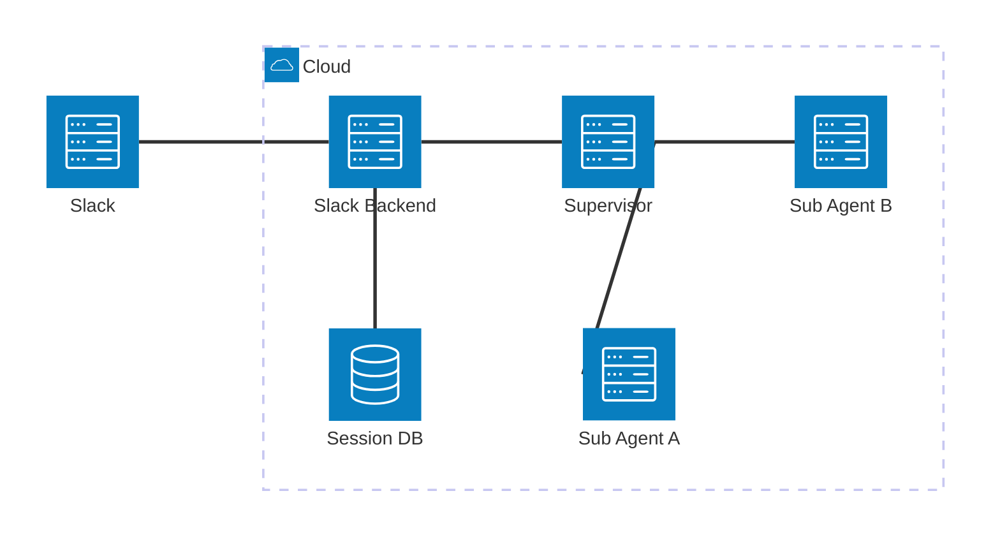

こんにちは。  
ご機嫌いかがでしょうか。  
"No human labor is no human error" が大好きな[吉井 亮](https://twitter.com/YoshiiRyo1)です。  

 [Spec Kit](https://github.com/github/spec-kit) を使った SDD (Specification Driven Development) にのめり込んでいます。  
試行錯誤しながら少しずつ勘所を掴み始めています。**1回のイテレーションで実装させる仕様を細かく積み上げていく** のが良さそうです。  
どうしてもコンテキストウインドウの制限があります。SDD ではタスク実行のたびに仕様を参照することで実装の一貫性を担保していると私は認識しています。
仕様が巨大になるとそれだけでコンテキストウインドウを圧迫し、出力されるコードの品質が下がるとの仮説を持っています。
ですので、仕様を細かく分解するのですが、SDD はそれなりにオーバーヘッドのある手法のように感じています。
イテレーションの回数を増やすと開発スピードが遅くなるデメリットが考えられます。
ちょうど良いバランスを見つけるのが重要そうです。

## 仕様を細かく積み上げるとは

Spec Kit でのイテレーションの流れを大きく書くと、仕様作成 → 実装計画作成 → タスクに分解 → タスクごとに実装・テストとなります。
ここの「仕様作成」をコーディングエージェントのコンテキストウインドウに収まるように細かく積み上げていくイメージです。




例えば、上記のような Slack Bot を開発すると仮定します。
私なら以下のように仕様を分解します。

1. IaC や CI/CD を整備する
2. 共通モジュールを作る
3. Supervisor を作る
   1. この段階では Bedrock のモデルを呼び出してチャットするだけの簡易な実装にする
   2. HTTP protocol contract は決めておく
4. Slack Backend を作る
   1. この段階では、Slack でメンションしたら "Hello" とだけ返す簡易な実装にする
5. Slack Backend と Supervisor を連携させる
6. Slack Backend にセッション管理機能を実装する
7. Sub Agent A を作る
8. Supervisor と Sub Agent A を連携させる
9. Sub Agent B を作る
10. Supervisor と Sub Agent B を連携させる
11. Supervisor に LLM Guardrails を実装する

これでもまだ分解レベルが足りない気がします。Sub Agent A に複数機能を持たせるのであれば、機能ごとにさらに分解します。

## ブランチはどうなるか？

仕様を分解した場合、ブランチ戦略はどうなるでしょうか？良い戦略があれば教えていただきたいです。
私は以下のように考えます。

Spec Kit では `仕様連番_仕様名` のようなブランチが生成されます。
「Supervisor を作る」 という仕様を実装する場合、`002_supervisor` のようなブランチが生成されます。ですので、`仕様連番_仕様名`(消さずに残しておく) → Staging → Main のようなブランチ戦略にしています。新しい仕様実装を開始する際は Staging ブランチから新しい仕様ブランチを切ります。

## 仕様のマージ

Spec Kit は `specs` ディレクトリ以下に仕様イテレーションごとの仕様が保存されます。

```bash
$ tree .
specs
├── 001-iac
│   ├── checklists
│   │   └── requirements.md
│   ├── contracts
│   │   └── openapi.yaml
│   ├── data-model.md
│   ├── integration-test-analysis.md
│   ├── plan.md
│   ├── quickstart.md
│   ├── research.md
│   ├── spec.md
│   └── tasks.md
├── 002-common-modules
│   └── 同上
├── 003-supervisor
│   └── 同上
├── 004-slack-backend
│   └── 同上
├── 005-connect-supervisor-slack-backend
│   └── 同上
├── 006-slack-backend-session-management
│   └── 同上
（以下略）
```

新しい仕様イテレーションを開始する際に、過去の仕様をコーディングエージェントに理解してもらう必要があります。そうしないと、過去の仕様を無視したコードが生成されてしまう可能性があります。
私は仕様イテレーションの最後に、過去の仕様を統合した仕様書を作成しています。`steering` ディレクトリ以下に保存しています。このディレクトリを示しながら`CLAUDE.md` などで過去の仕様を参照するようにという指示を出しています。

```bash
steering
├── slack_backend.md
├── subagenta.md
├── subagentb.md
└── supervisor.md
```

仕様書をマージするといっても、ファイルをそのままマージするわけではありません。  
過去の仕様書から機能要件を抜粋し、統合した仕様書を作成します。  
例えば、`slack_backend.md` は以下のようになります。
必要な場合のみ `specs` ディレクトリ以下を参照してもらう工夫を考えています。まだ試行錯誤してます。

```markdown
---
name: Specify Slack Backend
description: 統合仕様書（004/005/006の要約）
related_specs:
  - specs/004-slack-backend/spec.md
  - specs/005-connect-supervisor-slack-backend/spec.md
  - specs/006-slack-backend-session-management/spec.md
note: 詳細（ユーザーストーリー、受け入れシナリオ等）は各個別仕様書を参照
---

# 機能仕様書: Slack Backend（統合版）
## 概要
概要を記述

---

## 機能要件
### 004: Slack Backend 基盤
#### AAA機能（FR-001〜FR-005）
- **FR-001**: 実際は機能詳細が記述されている
- **FR-002**: 実際は機能詳細が記述されている
- **FR-003**: 実際は機能詳細が記述されている
- **FR-004**: 実際は機能詳細が記述されている
- **FR-005**: 実際は機能詳細が記述されている

#### BBB機能（FR-006〜FR-007）
- **FR-006**: 実際は機能詳細が記述されている
- **FR-007**: 実際は機能詳細が記述されている

（以下略）
```

## おまけ

Spec Kit を使った過去の話は以下です。

[Spec Kit で SRE AI Agent を開発する長い旅の始まり](https://zenn.dev/ryoyoshii/articles/053ebb9b4cdc58)  
[Spec Kit で SRE AI Agent を開発する 〜 仕様をガン詰めしながら決める](https://zenn.dev/mixi/articles/479e867ea910e6)  
