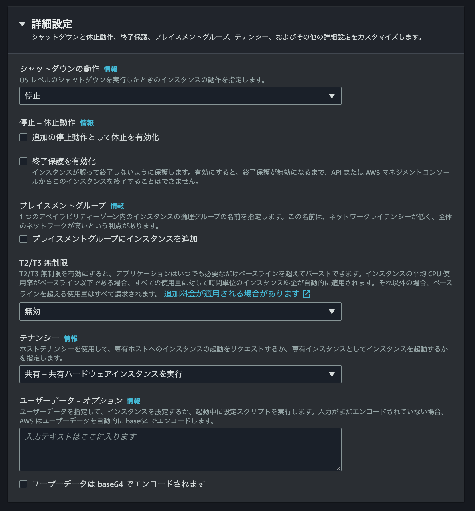

こんにちは。  
ご機嫌いかがでしょうか。  
"No human labor is no human error" が大好きな[吉井 亮](https://twitter.com/YoshiiRyo1)です。  

先日 [AWS パブリックIPアドレス 料金体系変更に対応する作業 EC2編](https://zenn.dev/ryoyoshii/articles/ecef64cde77b2f) という記事を書きました。AWS がパブリック IP アドレスに課金を始めるということで対策を考えています。  
EC2 インスタンスのパブリック IP アドレス自動付与設定はインスタンスの再作成になってしまいます。再作成方法は色々あるのですが、AWS Backup に可能性があるかどうかを調べてみました。  

本記事ではバックアップ元 EC2 インスタンスを作成し、AWS Backup でバックアップを取得、それをリストアして設定値を比較しています。
EC2 インスタンス作成、AWS Backup 設定は公式ユーザーガイド等を参考にして完了している前提で書いています。ご了承ください。  

EC2 デフォルト設定がリストアされることは容易に想像できたので少しだけ細かい EC2 設定を入れています。  

- パブリック IP アドレスを付与
- 詳細モニタリングを有効
- 停止保護を有効
- 終了保護を風光
- EBS ボリュームを1つ追加
- インスタンスプロファイルを設定
- タグを3つ追加
    - Name
    - OS
    - Env


さあ、これでどこまで戻るのか楽しみです。  

## マネジメントコンソールからリストア

マネジメントコンソールの AWS Backup 画面からインスタンスをリストアしました。
手順は [Restoring an Amazon EC2 instance](https://docs.aws.amazon.com/aws-backup/latest/devguide/restoring-ec2.html) を参照ください。  

途中 **保護されたリソースから復元されたリソースにタグをコピー** にチェックを入れます。  


リストアされインスタンスが起動しました。  
元インスタンスと設定値を比較したいので `ec2 describe-instances` を実行します。結果はファイルに出力です。  

```bash
# 元インスタンス
$ aws ec2 describe-instances --instance-ids i-0b641f133448c5870 > i-0b641f133448c5870.out

# リストアインスタンス
$ aws ec2 describe-instances --instance-ids i-02804bd1cd5d72eb4 > i-02804bd1cd5d72eb4.out
```

元インスタンスとリストア後インスタンスの出力ファイルを sdiff とり差分をピックアップします。  
`ImageId`、`InstanceId`、IP アドレス関連、DNS 名関連、〜〜Time は変更されるのが正解なので差分とし扱いません。  

- PublicIpAddress 
- Monitoring


:::details クリックして展開

```bash
$ sdiff i-0b641f133448c5870.out i-02804bd1cd5d72eb4.out 
{                                                               {
    "Reservations": [                                               "Reservations": [
        {                                                               {
            "Groups": [],                                                   "Groups": [],
            "Instances": [                                                  "Instances": [
                {                                                               {
                    "AmiLaunchIndex": 0,                                            "AmiLaunchIndex": 0,
                    "ImageId": "ami-00970f57473724c10",       |                     "ImageId": "ami-010f38efa8aa4a201",
                    "InstanceId": "i-0b641f133448c5870",      |                     "InstanceId": "i-02804bd1cd5d72eb4",
                    "InstanceType": "t2.micro",                                     "InstanceType": "t2.micro",
                    "KeyName": "RyoYoshii_backup_restore",                          "KeyName": "RyoYoshii_backup_restore",
                    "LaunchTime": "2023-08-01T00:54:41+00:00" |                     "LaunchTime": "2023-08-01T00:51:48+00:00"
                    "Monitoring": {                                                 "Monitoring": {
                        "State": "enabled"                    |                         "State": "disabled"
                    },                                                              },
                    "Placement": {                                                  "Placement": {
                        "AvailabilityZone": "us-west-2c",                               "AvailabilityZone": "us-west-2c",
                        "GroupName": "",                                                "GroupName": "",
                        "Tenancy": "default"                                            "Tenancy": "default"
                    },                                                              },
                    "PrivateDnsName": "ip-10-0-35-222.us-west |                     "PrivateDnsName": "ip-10-0-38-193.us-west
                    "PrivateIpAddress": "10.0.35.222",        |                     "PrivateIpAddress": "10.0.38.193",
                    "ProductCodes": [],                                             "ProductCodes": [],
                    "PublicDnsName": "ec2-34-211-141-138.us-w |                     "PublicDnsName": "",
                    "PublicIpAddress": "34.211.141.138",      <
                    "State": {                                                      "State": {
                        "Code": 16,                                                     "Code": 16,
                        "Name": "running"                                               "Name": "running"
                    },                                                              },
                    "StateTransitionReason": "",                                    "StateTransitionReason": "",
                    "SubnetId": "subnet-09ff3e0d0eba2b798",                         "SubnetId": "subnet-09ff3e0d0eba2b798",
                    "VpcId": "vpc-0610142586f930357",                               "VpcId": "vpc-0610142586f930357",
                    "Architecture": "x86_64",                                       "Architecture": "x86_64",
                    "BlockDeviceMappings": [                                        "BlockDeviceMappings": [
                        {                                                               {
                            "DeviceName": "/dev/xvda",                                      "DeviceName": "/dev/xvda",
                            "Ebs": {                                                        "Ebs": {
                                "AttachTime": "2023-08-01T00: |                                 "AttachTime": "2023-08-01T00:
                                "DeleteOnTermination": true,                                    "DeleteOnTermination": true,
                                "Status": "attached",                                           "Status": "attached",
                                "VolumeId": "vol-0a5618c8f0c0 |                                 "VolumeId": "vol-06ccee5434ad
                            }                                                               }
                        },                                                              },
                        {                                                               {
                            "DeviceName": "/dev/sdb",                                       "DeviceName": "/dev/sdb",
                            "Ebs": {                                                        "Ebs": {
                                "AttachTime": "2023-08-01T00: |                                 "AttachTime": "2023-08-01T00:
                                "DeleteOnTermination": true,                                    "DeleteOnTermination": true,
                                "Status": "attached",                                           "Status": "attached",
                                "VolumeId": "vol-09f8e094f4b8 |                                 "VolumeId": "vol-093495cd0635
                            }                                                               }
                        }                                                               }
                    ],                                                              ],
                    "ClientToken": "3951850d-8bf2-4b04-ac28-a |                     "ClientToken": "38B148DE-C2C7-D91F-65EE-2
                    "EbsOptimized": false,                                          "EbsOptimized": false,
                    "EnaSupport": true,                                             "EnaSupport": true,
                    "Hypervisor": "xen",                                            "Hypervisor": "xen",
                    "IamInstanceProfile": {                                         "IamInstanceProfile": {
                        "Arn": "arn:aws:iam::743846825521:ins                           "Arn": "arn:aws:iam::743846825521:ins
                        "Id": "AIPA22MFZZYYU5CZA7U5U"                                   "Id": "AIPA22MFZZYYU5CZA7U5U"
                    },                                                              },
                    "NetworkInterfaces": [                                          "NetworkInterfaces": [
                        {                                                               {
                            "Association": {                  <
                                "IpOwnerId": "amazon",        <
                                "PublicDnsName": "ec2-34-211- <
                                "PublicIp": "34.211.141.138"  <
                            },                                <
                            "Attachment": {                                                 "Attachment": {
                                "AttachTime": "2023-08-01T00: |                                 "AttachTime": "2023-08-01T00:
                                "AttachmentId": "eni-attach-0 |                                 "AttachmentId": "eni-attach-0
                                "DeleteOnTermination": true,                                    "DeleteOnTermination": true,
                                "DeviceIndex": 0,                                               "DeviceIndex": 0,
                                "Status": "attached",                                           "Status": "attached",
                                "NetworkCardIndex": 0                                           "NetworkCardIndex": 0
                            },                                                              },
                            "Description": "",                                              "Description": "",
                            "Groups": [                                                     "Groups": [
                                {                                                               {
                                    "GroupName": "RyoYoshii-t                                       "GroupName": "RyoYoshii-t
                                    "GroupId": "sg-031483be16                                       "GroupId": "sg-031483be16
                                }                                                               }
                            ],                                                              ],
                            "Ipv6Addresses": [],                                            "Ipv6Addresses": [],
                            "MacAddress": "0a:7f:cf:99:12:ff" |                             "MacAddress": "0a:71:09:4d:53:4d"
                            "NetworkInterfaceId": "eni-063b34 |                             "NetworkInterfaceId": "eni-006a7f
                            "OwnerId": "743846825521",                                      "OwnerId": "743846825521",
                            "PrivateDnsName": "ip-10-0-35-222 |                             "PrivateDnsName": "ip-10-0-38-193
                            "PrivateIpAddress": "10.0.35.222" |                             "PrivateIpAddress": "10.0.38.193"
                            "PrivateIpAddresses": [                                         "PrivateIpAddresses": [
                                {                                                               {
                                    "Association": {          <
                                        "IpOwnerId": "amazon" <
                                        "PublicDnsName": "ec2 <
                                        "PublicIp": "34.211.1 <
                                    },                        <
                                    "Primary": true,                                                "Primary": true,
                                    "PrivateDnsName": "ip-10- |                                     "PrivateDnsName": "ip-10-
                                    "PrivateIpAddress": "10.0 |                                     "PrivateIpAddress": "10.0
                                }                                                               }
                            ],                                                              ],
                            "SourceDestCheck": true,                                        "SourceDestCheck": true,
                            "Status": "in-use",                                             "Status": "in-use",
                            "SubnetId": "subnet-09ff3e0d0eba2                               "SubnetId": "subnet-09ff3e0d0eba2
                            "VpcId": "vpc-0610142586f930357",                               "VpcId": "vpc-0610142586f930357",
                            "InterfaceType": "interface"                                    "InterfaceType": "interface"
                        }                                                               }
                    ],                                                              ],
                    "RootDeviceName": "/dev/xvda",                                  "RootDeviceName": "/dev/xvda",
                    "RootDeviceType": "ebs",                                        "RootDeviceType": "ebs",
                    "SecurityGroups": [                                             "SecurityGroups": [
                        {                                                               {
                            "GroupName": "RyoYoshii-test-sg",                               "GroupName": "RyoYoshii-test-sg",
                            "GroupId": "sg-031483be16216aaf0"                               "GroupId": "sg-031483be16216aaf0"
                        }                                                               }
                    ],                                                              ],
                    "SourceDestCheck": true,                                        "SourceDestCheck": true,
                    "Tags": [                                                       "Tags": [
                        {                                                               {
                            "Key": "OS",                                                    "Key": "OS",
                            "Value": "Amazon Linux 2023"                                    "Value": "Amazon Linux 2023"
                        },                                                              },
                        {                                                               {
                            "Key": "Env",                     <
                            "Value": "stage"                  <
                        },                                    <
                        {                                     <
                            "Key": "Name",                                                  "Key": "Name",
                            "Value": "RyoYoshii_backup_restor                               "Value": "RyoYoshii_backup_restor
                                                              >                         },
                                                              >                         {
                                                              >                             "Key": "Env",
                                                              >                             "Value": "stage"
                        }                                                               }
                    ],                                                              ],
                    "VirtualizationType": "hvm",                                    "VirtualizationType": "hvm",
                    "CpuOptions": {                                                 "CpuOptions": {
                        "CoreCount": 1,                                                 "CoreCount": 1,
                        "ThreadsPerCore": 1                                             "ThreadsPerCore": 1
                    },                                                              },
                    "CapacityReservationSpecification": {                           "CapacityReservationSpecification": {
                        "CapacityReservationPreference": "ope                           "CapacityReservationPreference": "ope
                    },                                                              },
                    "HibernationOptions": {                                         "HibernationOptions": {
                        "Configured": false                                             "Configured": false
                    },                                                              },
                    "MetadataOptions": {                                            "MetadataOptions": {
                        "State": "applied",                                             "State": "applied",
                        "HttpTokens": "required",                                       "HttpTokens": "required",
                        "HttpPutResponseHopLimit": 2,                                   "HttpPutResponseHopLimit": 2,
                        "HttpEndpoint": "enabled",                                      "HttpEndpoint": "enabled",
                        "HttpProtocolIpv6": "disabled",                                 "HttpProtocolIpv6": "disabled",
                        "InstanceMetadataTags": "disabled"                              "InstanceMetadataTags": "disabled"
                    },                                                              },
                    "EnclaveOptions": {                                             "EnclaveOptions": {
                        "Enabled": false                                                "Enabled": false
                    },                                                              },
                    "BootMode": "uefi-preferred",                                   "BootMode": "uefi-preferred",
                    "PlatformDetails": "Linux/UNIX",                                "PlatformDetails": "Linux/UNIX",
                    "UsageOperation": "RunInstances",                               "UsageOperation": "RunInstances",
                    "UsageOperationUpdateTime": "2023-08-01T0 |                     "UsageOperationUpdateTime": "2023-08-01T0
                    "PrivateDnsNameOptions": {                                      "PrivateDnsNameOptions": {
                        "HostnameType": "ip-name",                                      "HostnameType": "ip-name",
                        "EnableResourceNameDnsARecord": false                           "EnableResourceNameDnsARecord": false
                        "EnableResourceNameDnsAAAARecord": fa                           "EnableResourceNameDnsAAAARecord": fa
                    },                                                              },
                    "MaintenanceOptions": {                                         "MaintenanceOptions": {
                        "AutoRecovery": "default"                                       "AutoRecovery": "default"
                    },                                                              },
                    "CurrentInstanceBootMode": "legacy-bios"                        "CurrentInstanceBootMode": "legacy-bios"
                }                                                               }
            ],                                                              ],
            "OwnerId": "743846825521",                                      "OwnerId": "743846825521",
            "ReservationId": "r-0cd1859aabb46a71d"            |             "RequesterId": "197132336604",
                                                              >             "ReservationId": "r-007e1d1660f4c1af2"
        }                                                               }
    ]                                                               ]
}                                                               }
```

:::

続いて `describe-instances` では拾えないインスタンス属性も比較します。  
インスタンス属性を取得するコマンドは `ec2 describe-instance-attribute` です。一気の全属性が取れそうにないので bash for で回します。  

```bash:attr.sh 
#!/bin/bash

InstanceId=$1

LIST="
instanceType
kernel
ramdisk
userData
disableApiTermination
instanceInitiatedShutdownBehavior
rootDeviceName
blockDeviceMapping
productCodes
sourceDestCheck
groupSet
ebsOptimized
sriovNetSupport
enclaveOptions
disableApiStop"

for l in $LIST
do
  aws ec2 describe-instance-attribute --instance-id ${InstanceId} --attribute $l | egrep -v InstanceId
done

exit 0
```

シェルスクリプトの引数にインスタンス ID を与えて実行します。例によって出力はファイルです。  

```bash
$ bash attr.sh i-0b641f133448c5870 > attr-i-0b641f133448c5870.out

$ bash attr.sh i-02804bd1cd5d72eb4 > attr-i-02804bd1cd5d72eb4.out
```

sdiff とり差分を確認します。  

- UserData
- DisableApiTermination
- DisableApiStop


:::details クリックして展開

```bash
$ sdiff attr-i-0b641f133448c5870.out attr-i-02804bd1cd5d72eb4.out 
{                                                               {
    "InstanceType": {                                               "InstanceType": {
        "Value": "t2.micro"                                             "Value": "t2.micro"
    }                                                               }
}                                                               }
{                                                               {
    "KernelId": {}                                                  "KernelId": {}
}                                                               }
{                                                               {
    "RamdiskId": {}                                                 "RamdiskId": {}
}                                                               }
{                                                               {
    "UserData": {                                             |     "UserData": {}
        "Value": "IyEvYmluL2Jhc2gKCnl1bSB1cGRhdGUgLXk="       <
    }                                                         <
}                                                               }
{                                                               {
    "DisableApiTermination": {                                      "DisableApiTermination": {
        "Value": true                                         |         "Value": false
    },                                                              },
}                                                               }
{                                                               {
    "InstanceInitiatedShutdownBehavior": {                          "InstanceInitiatedShutdownBehavior": {
        "Value": "stop"                                                 "Value": "stop"
    }                                                               }
}                                                               }
{                                                               {
    "RootDeviceName": {                                             "RootDeviceName": {
        "Value": "/dev/xvda"                                            "Value": "/dev/xvda"
    }                                                               }
}                                                               }
{                                                               {
    "BlockDeviceMappings": [                                        "BlockDeviceMappings": [
        {                                                               {
            "DeviceName": "/dev/xvda",                                      "DeviceName": "/dev/xvda",
            "Ebs": {                                                        "Ebs": {
                "AttachTime": "2023-08-01T00:18:03+00:00",    |                 "AttachTime": "2023-08-01T00:51:49+00:00",
                "DeleteOnTermination": true,                                    "DeleteOnTermination": true,
                "Status": "attached",                                           "Status": "attached",
                "VolumeId": "vol-0a5618c8f0c07ae33"           |                 "VolumeId": "vol-06ccee5434adac3cf"
            }                                                               }
        },                                                              },
        {                                                               {
            "DeviceName": "/dev/sdb",                                       "DeviceName": "/dev/sdb",
            "Ebs": {                                                        "Ebs": {
                "AttachTime": "2023-08-01T00:18:03+00:00",    |                 "AttachTime": "2023-08-01T00:51:49+00:00",
                "DeleteOnTermination": true,                                    "DeleteOnTermination": true,
                "Status": "attached",                                           "Status": "attached",
                "VolumeId": "vol-09f8e094f4b8fc82a"           |                 "VolumeId": "vol-093495cd06357e896"
            }                                                               }
        }                                                               }
    ],                                                              ],
}                                                               }
{                                                               {
    "ProductCodes": []                                              "ProductCodes": []
}                                                               }
{                                                               {
    "SourceDestCheck": {                                            "SourceDestCheck": {
        "Value": true                                                   "Value": true
    }                                                               }
}                                                               }
{                                                               {
    "Groups": [                                                     "Groups": [
        {                                                               {
            "GroupName": "RyoYoshii-test-sg",                               "GroupName": "RyoYoshii-test-sg",
            "GroupId": "sg-031483be16216aaf0"                               "GroupId": "sg-031483be16216aaf0"
        }                                                               }
    ],                                                              ],
}                                                               }
{                                                               {
    "EbsOptimized": {                                               "EbsOptimized": {
        "Value": false                                                  "Value": false
    },                                                              },
}                                                               }
{                                                               {
    "SriovNetSupport": {                                            "SriovNetSupport": {
        "Value": "simple"                                               "Value": "simple"
    }                                                               }
}                                                               }
{                                                               {
    "EnclaveOptions": {                                             "EnclaveOptions": {
        "Enabled": false                                                "Enabled": false
    },                                                              },
}                                                               }
{                                                               {
    "DisableApiStop": {                                             "DisableApiStop": {
        "Value": true                                         |         "Value": false
    }                                                               }
}                                                               }
```

:::


## なぜこうなったか

マネジメントコンソール での AWS Backup リストアは細かい値を設定できません。以下のスクショくらいかなと思います。  
マネジメントコンソールからのリストアは難易度が低く便利ではあるのですが、EC2 を使い込んでいるようなケースでは活用は難しそうは印象です。  

  

## 理想の手順

マネジメントコンソールからリストアはプラットフォームエンジニアとしては物足りないかもしれませんが、実は公式が便利な方法を教えてくれています。  

[AWS CLI を使用して AWS Backup のリカバリポイントから Amazon EC2 インスタンスを復元するにはどうすればよいですか?](https://repost.aws/ja/knowledge-center/aws-backup-ec2-restore-cli)  

詳しくは上のリンクを読んでほしいと思います。 `backup get-recovery-point-restore-metadata` コマンドで出力した結果を編集して適切なメタフィールドと値を記述したファイルに保存するところをもう少し説明します。  
この自分で作るファイルに書くメタフィールドは [API Reference RunInstances](https://docs.aws.amazon.com/AWSEC2/latest/APIReference/API_RunInstances.html) にリストされているものです。
API Reference をすみずみまで読み解きながらファイルを作っていきます。  

例えば、`backup get-recovery-point-restore-metadata` の結果では `SubnetId` が出力されますが、`SubnetId` は `NetworkInterfaces` のサブネット指定と重複できないので `SubnetId` 行は削除します、などのちょっとした工夫が必要です。  

基本的には [AWS CLI を使用して AWS Backup のリカバリポイントから Amazon EC2 インスタンスを復元するにはどうすればよいですか?](https://repost.aws/ja/knowledge-center/aws-backup-ec2-restore-cli) の例を真似して書けば失敗はないはずです。   

```json
{
"VpcId": "vpc-1a2b3c4d",
"Monitoring": "{\"State\":\"disabled\"}",
"CapacityReservationSpecification": "{\"CapacityReservationPreference\":\"open\"}",
"InstanceInitiatedShutdownBehavior": "stop",
"DisableApiTermination": "false",
"KeyName": "BackupTesting",
"CreditSpecification": "{\"CpuCredits\":\"standard\"}",
"HibernationOptions": "{\"Configured\":false}",
"EbsOptimized": "false",
"Placement": "{\"AvailabilityZone\":\"eu-west-1b\",\"GroupName\":\"\",\"Tenancy\":\"default\"}",
"aws:backup:request-id": "c1234567-ee7c-4896-beeb-ee123b456789",
"InstanceType": "t2.micro",
"NetworkInterfaces": "[{\"DeleteOnTermination\":true,\"Description\":\"Primary network interface\",\"DeviceIndex\":0,\"Groups\":[\"sg-0babcd1234567890f\"],\"Ipv6AddressCount\":0,\"Ipv6Addresses\":[],\"PrivateIpAddresses\":[{\"Primary\":true,\"PrivateIpAddress\":\"192.0.2.210\"}],\"SecondaryPrivateIpAddressCount\":1,\"SubnetId\":\"subnet-1a2b3c4d\",\"InterfaceType\":\"interface\"}]"
}
```

### リストア

メタフィールドと値を記述したファイルを作成したところリストアします。  
[AWS CLI を使用して AWS Backup のリカバリポイントから Amazon EC2 インスタンスを復元するにはどうすればよいですか?](https://repost.aws/ja/knowledge-center/aws-backup-ec2-restore-cli) の例に `--copy-source-tags-to-restored-resource` を追加して実行します。  

```bash
$ aws backup start-restore-job --region eu-west-1 --recovery-point-arn "arn:aws:ec2:eu-west-1::image/ami-012ab3456789c0123" --iam-role-arn "arn:aws:iam::123456789012:role/service-role/AWSBackupDefaultServiceRole"  --metadata file://ec2-restore-metadata.json --copy-source-tags-to-restored-resource
```

前と同じで `ec2 describe-instances` と `ec2 describe-instance-attribute` の結果を sdiff とります。  

`ec2 describe-instances` の差分は無視してよいもの以外は無くなりました。  


:::details クリックして展開

```bash
$ sdiff i-0b641f133448c5870.out i-0c6110ab03fb5f9a5.out 
{                                                               {
    "Reservations": [                                               "Reservations": [
        {                                                               {
            "Groups": [],                                                   "Groups": [],
            "Instances": [                                                  "Instances": [
                {                                                               {
                    "AmiLaunchIndex": 0,                                            "AmiLaunchIndex": 0,
                    "ImageId": "ami-00970f57473724c10",       |                     "ImageId": "ami-0aa2e136e2198c8d9",
                    "InstanceId": "i-0b641f133448c5870",      |                     "InstanceId": "i-0c6110ab03fb5f9a5",
                    "InstanceType": "t2.micro",                                     "InstanceType": "t2.micro",
                    "KeyName": "RyoYoshii_backup_restore",                          "KeyName": "RyoYoshii_backup_restore",
                    "LaunchTime": "2023-08-01T00:54:41+00:00" |                     "LaunchTime": "2023-08-01T04:44:01+00:00"
                    "Monitoring": {                                                 "Monitoring": {
                        "State": "enabled"                                              "State": "enabled"
                    },                                                              },
                    "Placement": {                                                  "Placement": {
                        "AvailabilityZone": "us-west-2c",                               "AvailabilityZone": "us-west-2c",
                        "GroupName": "",                                                "GroupName": "",
                        "Tenancy": "default"                                            "Tenancy": "default"
                    },                                                              },
                    "PrivateDnsName": "ip-10-0-35-222.us-west |                     "PrivateDnsName": "ip-10-0-35-12.us-west-
                    "PrivateIpAddress": "10.0.35.222",        |                     "PrivateIpAddress": "10.0.35.12",
                    "ProductCodes": [],                                             "ProductCodes": [],
                    "PublicDnsName": "ec2-34-211-141-138.us-w |                     "PublicDnsName": "ec2-18-236-220-191.us-w
                    "PublicIpAddress": "34.211.141.138",      |                     "PublicIpAddress": "18.236.220.191",
                    "State": {                                                      "State": {
                        "Code": 16,                                                     "Code": 16,
                        "Name": "running"                                               "Name": "running"
                    },                                                              },
                    "StateTransitionReason": "",                                    "StateTransitionReason": "",
                    "SubnetId": "subnet-09ff3e0d0eba2b798",                         "SubnetId": "subnet-09ff3e0d0eba2b798",
                    "VpcId": "vpc-0610142586f930357",                               "VpcId": "vpc-0610142586f930357",
                    "Architecture": "x86_64",                                       "Architecture": "x86_64",
                    "BlockDeviceMappings": [                                        "BlockDeviceMappings": [
                        {                                                               {
                            "DeviceName": "/dev/xvda",                                      "DeviceName": "/dev/xvda",
                            "Ebs": {                                                        "Ebs": {
                                "AttachTime": "2023-08-01T00: |                                 "AttachTime": "2023-08-01T04:
                                "DeleteOnTermination": true,                                    "DeleteOnTermination": true,
                                "Status": "attached",                                           "Status": "attached",
                                "VolumeId": "vol-0a5618c8f0c0 |                                 "VolumeId": "vol-0d8df54ae548
                            }                                                               }
                        },                                                              },
                        {                                                               {
                            "DeviceName": "/dev/sdb",                                       "DeviceName": "/dev/sdb",
                            "Ebs": {                                                        "Ebs": {
                                "AttachTime": "2023-08-01T00: |                                 "AttachTime": "2023-08-01T04:
                                "DeleteOnTermination": true,                                    "DeleteOnTermination": true,
                                "Status": "attached",                                           "Status": "attached",
                                "VolumeId": "vol-09f8e094f4b8 |                                 "VolumeId": "vol-0f6eba940f72
                            }                                                               }
                        }                                                               }
                    ],                                                              ],
                    "ClientToken": "3951850d-8bf2-4b04-ac28-a |                     "ClientToken": "37D92A52-FF73-62B2-3FEC-2
                    "EbsOptimized": false,                                          "EbsOptimized": false,
                    "EnaSupport": true,                                             "EnaSupport": true,
                    "Hypervisor": "xen",                                            "Hypervisor": "xen",
                    "IamInstanceProfile": {                                         "IamInstanceProfile": {
                        "Arn": "arn:aws:iam::743846825521:ins                           "Arn": "arn:aws:iam::743846825521:ins
                        "Id": "AIPA22MFZZYYU5CZA7U5U"                                   "Id": "AIPA22MFZZYYU5CZA7U5U"
                    },                                                              },
                    "NetworkInterfaces": [                                          "NetworkInterfaces": [
                        {                                                               {
                            "Association": {                                                "Association": {
                                "IpOwnerId": "amazon",                                          "IpOwnerId": "amazon",
                                "PublicDnsName": "ec2-34-211- |                                 "PublicDnsName": "ec2-18-236-
                                "PublicIp": "34.211.141.138"  |                                 "PublicIp": "18.236.220.191"
                            },                                                              },
                            "Attachment": {                                                 "Attachment": {
                                "AttachTime": "2023-08-01T00: |                                 "AttachTime": "2023-08-01T04:
                                "AttachmentId": "eni-attach-0 |                                 "AttachmentId": "eni-attach-0
                                "DeleteOnTermination": true,                                    "DeleteOnTermination": true,
                                "DeviceIndex": 0,                                               "DeviceIndex": 0,
                                "Status": "attached",                                           "Status": "attached",
                                "NetworkCardIndex": 0                                           "NetworkCardIndex": 0
                            },                                                              },
                            "Description": "",                                              "Description": "",
                            "Groups": [                                                     "Groups": [
                                {                                                               {
                                    "GroupName": "RyoYoshii-t                                       "GroupName": "RyoYoshii-t
                                    "GroupId": "sg-031483be16                                       "GroupId": "sg-031483be16
                                }                                                               }
                            ],                                                              ],
                            "Ipv6Addresses": [],                                            "Ipv6Addresses": [],
                            "MacAddress": "0a:7f:cf:99:12:ff" |                             "MacAddress": "0a:d2:98:d0:4d:d5"
                            "NetworkInterfaceId": "eni-063b34 |                             "NetworkInterfaceId": "eni-0e9748
                            "OwnerId": "743846825521",                                      "OwnerId": "743846825521",
                            "PrivateDnsName": "ip-10-0-35-222 |                             "PrivateDnsName": "ip-10-0-35-12.
                            "PrivateIpAddress": "10.0.35.222" |                             "PrivateIpAddress": "10.0.35.12",
                            "PrivateIpAddresses": [                                         "PrivateIpAddresses": [
                                {                                                               {
                                    "Association": {                                                "Association": {
                                        "IpOwnerId": "amazon"                                           "IpOwnerId": "amazon"
                                        "PublicDnsName": "ec2 |                                         "PublicDnsName": "ec2
                                        "PublicIp": "34.211.1 |                                         "PublicIp": "18.236.2
                                    },                                                              },
                                    "Primary": true,                                                "Primary": true,
                                    "PrivateDnsName": "ip-10- |                                     "PrivateDnsName": "ip-10-
                                    "PrivateIpAddress": "10.0 |                                     "PrivateIpAddress": "10.0
                                }                                                               }
                            ],                                                              ],
                            "SourceDestCheck": true,                                        "SourceDestCheck": true,
                            "Status": "in-use",                                             "Status": "in-use",
                            "SubnetId": "subnet-09ff3e0d0eba2                               "SubnetId": "subnet-09ff3e0d0eba2
                            "VpcId": "vpc-0610142586f930357",                               "VpcId": "vpc-0610142586f930357",
                            "InterfaceType": "interface"                                    "InterfaceType": "interface"
                        }                                                               }
                    ],                                                              ],
                    "RootDeviceName": "/dev/xvda",                                  "RootDeviceName": "/dev/xvda",
                    "RootDeviceType": "ebs",                                        "RootDeviceType": "ebs",
                    "SecurityGroups": [                                             "SecurityGroups": [
                        {                                                               {
                            "GroupName": "RyoYoshii-test-sg",                               "GroupName": "RyoYoshii-test-sg",
                            "GroupId": "sg-031483be16216aaf0"                               "GroupId": "sg-031483be16216aaf0"
                        }                                                               }
                    ],                                                              ],
                    "SourceDestCheck": true,                                        "SourceDestCheck": true,
                    "Tags": [                                                       "Tags": [
                        {                                                               {
                            "Key": "OS",                      |                             "Key": "Name",
                            "Value": "Amazon Linux 2023"      |                             "Value": "RyoYoshii_backup_restor
                        },                                                              },
                        {                                                               {
                            "Key": "Env",                                                   "Key": "Env",
                            "Value": "stage"                                                "Value": "stage"
                        },                                                              },
                        {                                                               {
                            "Key": "Name",                    |                             "Key": "OS",
                            "Value": "RyoYoshii_backup_restor |                             "Value": "Amazon Linux 2023"
                        }                                                               }
                    ],                                                              ],
                    "VirtualizationType": "hvm",                                    "VirtualizationType": "hvm",
                    "CpuOptions": {                                                 "CpuOptions": {
                        "CoreCount": 1,                                                 "CoreCount": 1,
                        "ThreadsPerCore": 1                                             "ThreadsPerCore": 1
                    },                                                              },
                    "CapacityReservationSpecification": {                           "CapacityReservationSpecification": {
                        "CapacityReservationPreference": "ope                           "CapacityReservationPreference": "ope
                    },                                                              },
                    "HibernationOptions": {                                         "HibernationOptions": {
                        "Configured": false                                             "Configured": false
                    },                                                              },
                    "MetadataOptions": {                                            "MetadataOptions": {
                        "State": "applied",                                             "State": "applied",
                        "HttpTokens": "required",                                       "HttpTokens": "required",
                        "HttpPutResponseHopLimit": 2,                                   "HttpPutResponseHopLimit": 2,
                        "HttpEndpoint": "enabled",                                      "HttpEndpoint": "enabled",
                        "HttpProtocolIpv6": "disabled",                                 "HttpProtocolIpv6": "disabled",
                        "InstanceMetadataTags": "disabled"                              "InstanceMetadataTags": "disabled"
                    },                                                              },
                    "EnclaveOptions": {                                             "EnclaveOptions": {
                        "Enabled": false                                                "Enabled": false
                    },                                                              },
                    "BootMode": "uefi-preferred",                                   "BootMode": "uefi-preferred",
                    "PlatformDetails": "Linux/UNIX",                                "PlatformDetails": "Linux/UNIX",
                    "UsageOperation": "RunInstances",                               "UsageOperation": "RunInstances",
                    "UsageOperationUpdateTime": "2023-08-01T0 |                     "UsageOperationUpdateTime": "2023-08-01T0
                    "PrivateDnsNameOptions": {                                      "PrivateDnsNameOptions": {
                        "HostnameType": "ip-name",                                      "HostnameType": "ip-name",
                        "EnableResourceNameDnsARecord": false                           "EnableResourceNameDnsARecord": false
                        "EnableResourceNameDnsAAAARecord": fa                           "EnableResourceNameDnsAAAARecord": fa
                    },                                                              },
                    "MaintenanceOptions": {                                         "MaintenanceOptions": {
                        "AutoRecovery": "default"                                       "AutoRecovery": "default"
                    },                                                              },
                    "CurrentInstanceBootMode": "legacy-bios"                        "CurrentInstanceBootMode": "legacy-bios"
                }                                                               }
            ],                                                              ],
            "OwnerId": "743846825521",                                      "OwnerId": "743846825521",
            "ReservationId": "r-0cd1859aabb46a71d"            |             "RequesterId": "197132336604",
                                                              >             "ReservationId": "r-02432f15cd0a45cfd"
        }                                                               }
    ]                                                               ]
}                                                               }

```

:::


`ec2 describe-instance-attribute` の差分です。  

- UserData
- DisableApiStop

:::details クリックして展開

```bash
$ sdiff attr-i-0b641f133448c5870.out attr-i-0c6110ab03fb5f9a5.out 
{                                                               {
    "InstanceType": {                                               "InstanceType": {
        "Value": "t2.micro"                                             "Value": "t2.micro"
    }                                                               }
}                                                               }
{                                                               {
    "KernelId": {}                                                  "KernelId": {}
}                                                               }
{                                                               {
    "RamdiskId": {}                                                 "RamdiskId": {}
}                                                               }
{                                                               {
    "UserData": {                                             |     "UserData": {}
        "Value": "IyEvYmluL2Jhc2gKCnl1bSB1cGRhdGUgLXk="       <
    }                                                         <
}                                                               }
{                                                               {
    "DisableApiTermination": {                                      "DisableApiTermination": {
        "Value": true                                                   "Value": true
    },                                                              },
}                                                               }
{                                                               {
    "InstanceInitiatedShutdownBehavior": {                          "InstanceInitiatedShutdownBehavior": {
        "Value": "stop"                                                 "Value": "stop"
    }                                                               }
}                                                               }
{                                                               {
    "RootDeviceName": {                                             "RootDeviceName": {
        "Value": "/dev/xvda"                                            "Value": "/dev/xvda"
    }                                                               }
}                                                               }
{                                                               {
    "BlockDeviceMappings": [                                        "BlockDeviceMappings": [
        {                                                               {
            "DeviceName": "/dev/xvda",                                      "DeviceName": "/dev/xvda",
            "Ebs": {                                                        "Ebs": {
                "AttachTime": "2023-08-01T00:18:03+00:00",    |                 "AttachTime": "2023-08-01T04:44:02+00:00",
                "DeleteOnTermination": true,                                    "DeleteOnTermination": true,
                "Status": "attached",                                           "Status": "attached",
                "VolumeId": "vol-0a5618c8f0c07ae33"           |                 "VolumeId": "vol-0d8df54ae5488fe09"
            }                                                               }
        },                                                              },
        {                                                               {
            "DeviceName": "/dev/sdb",                                       "DeviceName": "/dev/sdb",
            "Ebs": {                                                        "Ebs": {
                "AttachTime": "2023-08-01T00:18:03+00:00",    |                 "AttachTime": "2023-08-01T04:44:02+00:00",
                "DeleteOnTermination": true,                                    "DeleteOnTermination": true,
                "Status": "attached",                                           "Status": "attached",
                "VolumeId": "vol-09f8e094f4b8fc82a"           |                 "VolumeId": "vol-0f6eba940f72b1625"
            }                                                               }
        }                                                               }
    ],                                                              ],
}                                                               }
{                                                               {
    "ProductCodes": []                                              "ProductCodes": []
}                                                               }
{                                                               {
    "SourceDestCheck": {                                            "SourceDestCheck": {
        "Value": true                                                   "Value": true
    }                                                               }
}                                                               }
{                                                               {
    "Groups": [                                                     "Groups": [
        {                                                               {
            "GroupName": "RyoYoshii-test-sg",                               "GroupName": "RyoYoshii-test-sg",
            "GroupId": "sg-031483be16216aaf0"                               "GroupId": "sg-031483be16216aaf0"
        }                                                               }
    ],                                                              ],
}                                                               }
{                                                               {
    "EbsOptimized": {                                               "EbsOptimized": {
        "Value": false                                                  "Value": false
    },                                                              },
}                                                               }
{                                                               {
    "SriovNetSupport": {                                            "SriovNetSupport": {
        "Value": "simple"                                               "Value": "simple"
    }                                                               }
}                                                               }
{                                                               {
    "EnclaveOptions": {                                             "EnclaveOptions": {
        "Enabled": false                                                "Enabled": false
    },                                                              },
}                                                               }
{                                                               {
    "DisableApiStop": {                                             "DisableApiStop": {
        "Value": true                                         |         "Value": false
    }                                                               }
}                         
```

:::

### 検証

インスタンス属性に差分が出てしまいました。  
`backup get-recovery-point-restore-metadata` の結果からメタフィールドを記述したファイルを生成し、それを基にリストアしました。が、情報が不足していたからだと考えます。  
完全に同じインスタンスとしてリストアするには [API Reference RunInstances](https://docs.aws.amazon.com/AWSEC2/latest/APIReference/API_RunInstances.html) にリストされているメタフィールドから不足分を自分で記述してあげないとならないようです。      
正直それなら RunInstances を実行したほうが自動化しやすいと個人的に感じてしまいました。。。  

## まとめ

軽く EC2 を使っている程度なら AWS Backup からのリストアは便利だと思います。  
ただ、ゴリゴリカスタマイズした環境で使っていると不足してくる箇所も出てきました。
